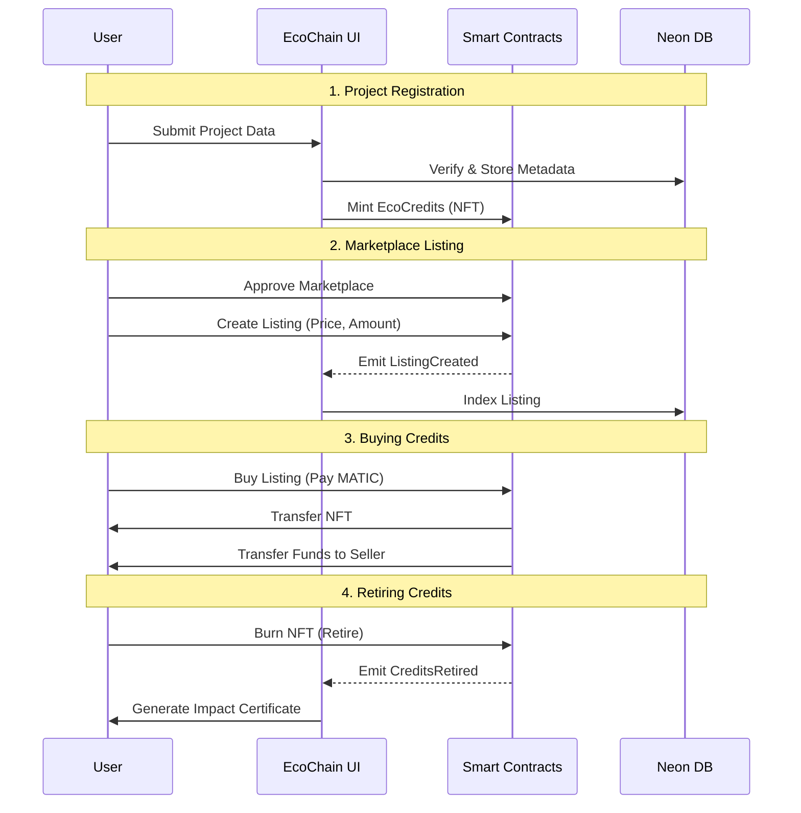

# EcoChain — Carbon Credit Marketplace

EcoChain is a decentralized application (dApp) built on the Polygon Amoy testnet that allows users to purchase, retire, and track verified carbon credits. It combines blockchain transparency with real-world impact data.


## 🏗 Architecture

EcoChain follows a hybrid architecture, leveraging both on-chain smart contracts for asset management and off-chain databases for rich metadata and indexing.

### Core Components

1.  **Frontend Layer (Next.js 16)**
    *   **App Router**: Uses React Server Components (RSC) for data fetching and performance.
    *   **RainbowKit + Wagmi**: Handles wallet connection and blockchain interactions.
    *   **Server Actions**: Securely handles database mutations (e.g., syncing project data).

2.  **Smart Contract Layer (Polygon Amoy)**
    *   **EcoCredits (ERC-1155)**: Represents carbon credits. Each Token ID corresponds to a specific project batch. Features minting and burning (retiring).
    *   **EcoMarketplace**: Facilitates the buying and selling of credits. Users can list their credits or buy from others.
    *   **Contracts**:
        *   `EcoCredits.sol`: The NFT contract.
        *   `EcoMarketplace.sol`: The exchange contract.

3.  **Data Layer**
    *   **Neon DB (Serverless Postgres)**: Stores project details, user profiles, and transaction history for fast querying.
    *   **Drizzle ORM**: Type-safe database interactions.
    *   **@neondatabase/serverless**: Connection pooling for serverless environments.

### Data Flow


<details>
<summary>View as Mermaid (for GitHub rendering)</summary>

```mermaid
graph TD
    User[User Wallet] -->|Connect| Frontend[Next.js App]
    Frontend -->|Read/Write| Contract[Smart Contracts (Polygon)]
    Frontend -->|Fetch/Sync| DB[(Neon Postgres)]
    Contract -->|Events| Indexer[Frontend Indexer]
    Indexer -->|Update| DB
```

</details>

## 🚀 Workflow Analysis


<details>
<summary>View as Mermaid (for GitHub rendering)</summary>



</details>

### 1. Project Registration & Verification
*   **Off-Chain**: Carbon project data (location, impact, type) is verified and stored in the **Neon DB**.
*   **On-Chain**: A corresponding Token ID is created in the **EcoCredits** contract.

### 2. Marketplace Listing
*   **Seller**: Approves the Marketplace contract to spend their credits.
*   **Transaction**: Calls `createListing(tokenId, price, amount)` on the Marketplace contract.
*   **UI Update**: The frontend listens for `ListingCreated` events and updates the UI.

### 3. Buying Credits
*   **Buyer**: Connects wallet (MetaMask/Rainbow).
*   **Transaction**: Calls `buyListing(listingId)` with the required MATIC.
*   **Transfer**: The contract transfers MATIC to the seller and credits (NFTs) to the buyer.

### 4. Retiring Credits (The "Impact" Action)
*   **User**: Selects credits to retire.
*   **Transaction**: Calls `burn(tokenId, amount)` on the EcoCredits contract.
*   **Certificate**: The app generates a retirement certificate (PDF) using the transaction hash as proof-of-burn.

## 🛠️ Tech Stack

-   **Framework**: [Next.js 16](https://nextjs.org/) (App Router, Turbopack)
-   **Language**: [TypeScript](https://www.typescriptlang.org/)
-   **Styling**: [Tailwind CSS](https://tailwindcss.com/) + [shadcn/ui](https://ui.shadcn.com/)
-   **Blockchain**: [Hardhat](https://hardhat.org/) (Solidity/Testing/Deploying)
-   **Wallet**: [RainbowKit](https://www.rainbowkit.com/) + [Wagmi](https://wagmi.sh/) + [Viem](https://viem.sh/)
-   **Database**: [Neon](https://neon.tech/) (Postgres) + [Drizzle ORM](https://orm.drizzle.team/)
-   **Maps**: [Leaflet](https://leafletjs.com/) (Impact Map)

## 📦 Installation & Setup

### Prerequisites

-   Node.js 18+
-   npm or pnpm
-   MetaMask Wallet (connected to Amoy Testnet)

### 1. Clone the Repository
```bash
git clone https://github.com/your-username/eco-chain.git
cd eco-chain
```

### 2. Install Dependencies
```bash
npm install
```

### 3. Environment Variables
Create a `.env.local` file based on `.env.example`:

```bash
cp .env.example .env.local
```

Fill in your secrets:
-   `DATABASE_URL`: Your Neon Postgres connection string.
-   `NEXT_PUBLIC_WALLET_CONNECT_PROJECT_ID`: Get from [WalletConnect Cloud](https://cloud.walletconnect.com/).
-   `NEXT_PUBLIC_ALCHEMY_API_KEY`: Your Alchemy RPC key for Polygon Amoy.
-   `PRIVATE_KEY`: Your wallet private key (for deploying contracts).

### 4. Run Development Server
```bash
npm run dev
```
Open [http://localhost:3000](http://localhost:3000) to see the app.

## ⛓️ Smart Contracts

### Compile
```bash
npm run contracts:compile
```

### Deploy to Amoy Testnet
Ensure you have MATIC in your deployer wallet.
```bash
npm run contracts:deploy
```
*   **EcoCredits**: `0x595b507fa5BF3f251000fC019c697932d3D3C61A`
*   **EcoMarketplace**: `[Pending Deployment]`

### Local Hardhat Network
```bash
npm run contracts:deploy:local
```

## 🧪 Testing

Run strict type checking and linting:
```bash
npm run type-check
npm run lint
```
